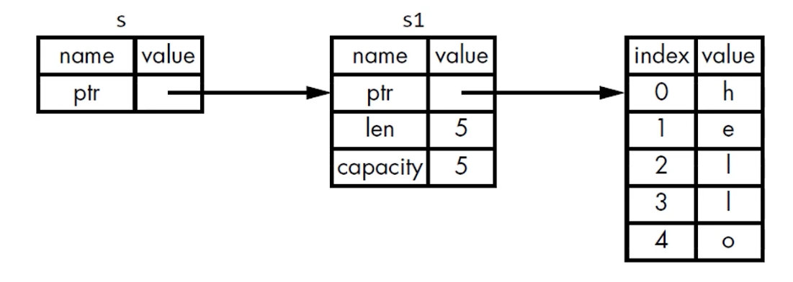

# Rust book 学习笔记

- **《The Rust Programming Language》或中文版《Rust权威指南》**


**Rust 是什么？为什么要用Rust？**

Rust 是一种快速、高并发、安全的编程语言，可以让每个人编写可靠且高效的软件


**Rust 语言的特性：**

- 编译期内存安全：安全
- 零成本抽象：高性能
- 支持高并发：无畏并发


**Rust 语言适合的场景：**

- 需要运行时的速度
- 需要内存安全
- 更好地利用多处理器


**Rust 特别擅长的领域：**

- 高性能Web Service
- WebAssembly
- 命令行工具
- 网络编程
- 嵌入式设备
- 系统编程


## 说明

- **每个知识点对应一个binary crate,即src下的一个文件，用cargo workspace管理**
- **运行：用cargo run --bin 文件夹名称（ 即binary crate name）的方式运行**
- **测试：例如lib项目auto_test，测命令 cargo test -p auto_test**

## 1、依赖 

- ​	**添加crate 依赖：**
  - **在Cargo.toml文件[dependencies]下可按照如下的格式添加依赖**
  - **rand = "0.7.0"**
  - **rust 采用的是语义化版本控制，具体见[SemVer](https://semver.org)**


## 2、变量和数据类型

### 	4种标量类型

- 整数类型：
  - 整数的表达方法，除了Byte外，其他整数类型可以使用类型作后缀：如：98**u32**

- 浮点类型

- 布尔类型

- 字符类型


### 2种复合类型

- tuple
  - （）
  - 保存多个类型的多个值
  - 长度固定，一旦声明不能更改
  - 支持使用模式匹配进行解构，也只支持使用索引来访问
  - 存放在栈内存上
- 数组
  - []
  - 保存同一类型的多个值
  - 其他同tuple

### 数组声明

```rust
pub fn main() {
    //[类型;长度]
    let x: [i32; 5] = [1, 2, 3, 4, 5];

    //[初始值;长度]
    let y = [3; 5];
}
```

### 数组越界

- 编译时会进行力所能及的检查（直接给出大于数组长度的索引值，编译器会报错，但写的逻辑复杂一点就检查不出来了）
- 运行时会报错

### 整数溢出

例如:

u8 的范围是 0-255，如果你把一个 u8 变量的值设为 256，那么：

- 调试模式下编译：Rust 会检查整数溢出，如果发生溢出，程序在运行时就会 panic
- 发布模式下 (--release)编译：Rust 不会检查可能导致 panic 的整数溢出：
  - 如果溢出发生，Rust 会执行“环绕”操作：256 变成 0，257 变成 1...
  - 但程序不会 panic

### 字符类型

Rust 语言中 char 类型被用来描述语言中最基础的单个字符：

- 字符类型的字面值使用单引号
- 占用 4 字节大小
- 是 Unicode 标量值，可以表示比 ASCI 多得多的字符内容:拼音、中日韩文、零长度空白字符、emoji 表情等：
  - U+0000 到 U+D7FF
  - U+E000 到 U+10FFFF

- 但 Unicode 中并没有“字符”的概念，所以直觉上认为的字符也许与 Rust 中的概念并不相符。

### 常量

常量(constant)在绑定值以后也是不可变的，但是它与不可变的变量有很多区别:

- 不可以使用 mut，常量永远都是不可变的
- 声明常量使用 const 关键字，它的类型必须被标注
- 常量可以在任何作用域内进行声明，包括全局作用域
- 常量只可以绑定到常量表达式，无法绑定到函数的调用结果或只能在运行时才能计算出的值
- 在程序运行期间，常量在其声明的作用域内一直有效
- 命名规范：Rust 里常量使用全大写字母，每个单词之间用下划线分开，例如：MAX_POINTS

- 例子：
  -  const MAX_POINTS: u32 = 100_000;

### Shadowing(隐藏)

可以使用相同的名字声明新的变量，新的变量就会 shadow (隐藏)之前声明的同名变量，在后续的代码中这个变量名代表的就是新的变量。

### 推断数据类型

Rust 是静态编译语言，在编译时必须知道所有变量的类型

- 基于使用的值，编译器通常能够推断出它的具体类型
- 但如果可能的类型比较多(例如把 String 转为整数的 parse 方法) ，就必须添加类型的标注，否则编译会报错。

### 函数

- 函数或者代码块{}的最后一个表达式（不带分号，即；）即为函数或者代码块的返回值，语句（带分号）的返回值为空tuple，即（）
- 也可以使用return返回，返回值必须在函数声明中指明类型
- let 关键字只能在函数内部声明变量

### 控制流

**if else**

- if 后面必须是bool类型的值
- Rust不会像python等语言一样，把空字符串、空列表等转化为bool值False.

**loop、while**

很简单，没什么需要说的

**for**

rust的for循环，被编译器扩展成了方法的调用，如下表：

| 简化形式                    | 等价于                                          | 访问级别           |
| --------------------------- | ----------------------------------------------- | ------------------ |
| for item in collection      | for item in IntoIterator::into_iter(collection) | 拥有所有权         |
| for item in &collection     | for item in collection.iter()                   | 只读（不可变引用） |
| for item in mut &collection | for item in collection.iter_mut()               | 读/写（可变引用）  |


## 3、变量所有权Ownership

什么是所有权？Rust是如何管理变量所有权的？

回答这个问题需要先了解一下几个方面的内容：


### Stack vs Heap存储数据

Stack 按值的接收顺序来存储，按相反的顺序将它们移除(后进先出，LIFO)

- 添加数据叫做压入栈
- 移除数据叫做弹出栈

所有存储在 Stack 上的数据必须拥有已知的固定的大小；编译时大小未知的数据或运行时大小可能发生变化的数据必须存放在 heap 上。


Heap 内存组织性差一些:

- 当你把数据放入 heap 时，你会请求一定数量的空间。
- 操作系统在 heap 里找到一块足够大的空间，把它标记为在用，并返回一个指针，也就是这个空间的地址。
- 这个过程叫做在 heap 上进行分配，有时仅仅称为“分配”。


### rust的数据存储

存储在stack 上的数据：

- 实现了copy trait的数据存在stack上，通过只拷贝存储在栈上的位来复制值
- 如果一个类型或者类型的一部分实现了drop trait ,就不允许再实现copy trait

- 拥有copy trait的类型：
  - 4种标量类型（整数类型、浮点类型、布尔类型、字符类型）
  - tuple ，如果其中所有元素都是实现了copy trait的话


存储在heap 上的数据：

- 数据对象存储在stack上，而数据本身存储在heap上。
- 以String类型为例，stack上存储以下内容：
  - 指针：一个指向heap上存储字符串内容的内存指针
  - 长度：len，存放字符串内容所需的字节数
  - 容量：cpacity，String类型从操作系统中总共获得的内存字节数


### 所有权规则

大多数语言管理内存的方式分为两种：

- 垃圾收集机制（GC），在程序运行时，不断地寻找不再使用的内存（性能低）
- 由程序员显示地分配和释放内存（不安全）


而Rust采用了第三种方式：

- 通过一个所有权系统来管理内存，其中包含了一组所权规则，编译器在编译阶段会按照规则检查代码
- 也就是说，Rust把内存管理相关的工作都提前到了编译时，不会产生运行时开销，不会减慢程序运行的速度


所有权规则：

- 每个值都有一个变量，这个变量是该值的所有者
- 每个值同时只能有一个所有者
- 当所有者超出作用域时，该值被删除（自动调用drop函数）


### 所有权解决的问题

- 踪代码的哪些部分正在使用 heap 的哪些数据。
- 最小化 heap 上的重复数据量。
- 清理 heap 上未使用的数据以避免空间不足。

一句话，管理 heap 数据是所有权存在的原因。


### rust的所有权转移（move）

存储在stack 上，实现了copy trait的数据类型在所有权转移时会复制一份数据给新变量：

```rust
fn main() {
    let x = 5;
    let y = x;
    println!("{x},{y}");
}
```


存储在heap上的数据，当所有权转移时，Rust会：

- 复制数据在stack上的数据对象，包括数据对象当中包含的指针、长度、容量信息。
- 但不复制heap上的数据本身。
- 并且将之前的旧的数据对象销毁。


因为旧的数据对象被销毁，所以下面的代码报错：borrow of moved value: `x`

```rust
fn main() {
    let x = String::from("hello");
    let y = x;
    println!("{x},{y}");
}
```


那么，如果真想对 heap 上面的数据本身进行复制，而不仅仅是复制stack 上的数据数据对象，怎么做呢？

实现 clone trait，然后显示调用 **.clone()** 方法，如下：

```rust
fn main() {
    let x = String::from("hello");
    let y = x.clone();
    println!("{x},{y}");
}
```


### 所有权和函数

- 函数的调用和返回值也伴随着所有权的转移，和把值赋给变量是类似的，即：
  - 要么移动：把变量的所有权移交给函数（对于存储在heap上的数据类型）
  - 要么复制：把变量复制一份，把副本传递给函数（对于存储在stack上的数据类型）

- 函数的返回值同样伴随着所有权的移动
  - 返回变量所有权（heap类型）
  - 返回变量的副本（stack类型）


### 引用和借用：引用的规则

**什么是引用？**

```rust
fn main() {
    let s1 = String::from("Hello");
    let len = calculate_length(&s1);
    println!("The length of'{}' is {}.", s1, len);
}

fn calculate_length(s: &String) -> usize {
    s.len()
}
```


上面的代码中，s就是s1的引用，引用的可以理解成某种“二次指针”，如下图：




- &：引用的表示符号，允许使用变量的值而不取得变量的所有权

- 引用的本质：reference

- 引用和变量一样，也有可变性和不可变性，在同一个作用域内，只能满足下列条件中的一个，不能同时满足

  - 一个可变的引用
  - 任意数不可变的引用

  

  如果需要创建多个可变的引用怎么办？

  用{}划分不同的作用域

  

**那如何让函数使用某个值，但不获得所有权？**

- 借用：把变量的引用作为函数的参数的行为
- 使用的变量的引用作为形参使API更具通用型，并不会带来性能上的损失


### 切片

- 切片：对变量中部分内容的引用，形式：&[开始索引..结束索引]
- 适用于String、array、Vector等数据类型
- 切片的语法糖：
  - &[..从开始到索引]
  - &[从索引到结束..]
  - &[..] 表示整个数据的切片
- **字符串字面值就是String字符串切片**


## 4、结构体struct

- struct初始化
  - 实例化时必须为所有字段赋值，字段是无序的
  - 使用 `let` 默认示例化的 struct 是不可变（immutable），可以通过 `let mut` 声明可变（mutable）的 struct
  - 可变的 struct 实例，所有字段都是可变的，不允许某个字段可变，其他不可变的情况
  - 简写规则：若字段名和字段值对应变量名相同时，可以使用字段名初始化
  
- struct更新
  - 基于某个 struct 实例创建一个新的 struct 实例时，可以在新的实例中使用 `..实例名` 来替代不需要修改的字段，需要修改的字段需要单独指定
  
  - ```rust
    pub struct User {
        pub username: String,
        pub password: String,
        pub sign: u32,
        pub active: bool,
    }
    pub fn run() {
        let u1 = User {
            username: String::from("u1"),
            password: String::from("u1_pass"),
            sign: 10,
            active: false,
        };
    
        let u2 = User {
            username: String::from("u2"),
            password: String::from("u2_pass"),
            //更新struct的语法糖
            ..u1
        };
    }
    ```
  
  
  
- Tuple struct
  
  - 可定义类似 tuple 的 struct，叫做 tuple struct
  
  - Tuple struct 整体有个名，但里面的元素没有名
  
  - 适用场景：想给整个 tuple 起名，并让它不同于其它 tuple，而且又不需要给每个元素起名定义 
  
  - tuple struct：使用 struct 关键字，后边是名字，以及里面元素的类型，例子：
  
    ```rust
    struct Color(i32, i32, i32);
    struct Point(i32, i32, i32);
    
    fn main() {
        //注意：black 和 origin 是不同的类型，是不同 tuple struct 的实例
        let black = Color(0, 0, 0);
        let origin = Point(0, 0, 0);
    }
    ```
  
  
  
  
  
- Unit-Like Struct (没有任何字段)
  
  - 可以定义没有任何字段的 struct，叫做 Unit-Like struct（因为与()，单元类型类似）
  - 适用于需要在某个类型上实现某个 trait，但是在里面又没有想要存储的数据
  
  
  
- struct数据所有权
  - 若实例拥有 struct 里所有字段的所有权，则 struct 拥有所有权
  - 若存在引用（如`&str`）类型的字段，则需要使用`生命周期（lifetime specifier）`
    - 若生命周期保证struct实例是有效的，则里面的引用也是有效的
    - 若struct里面存储引用，且不使用生命周期，则会报错
    
    

- struct方法
  - 在 `impl` 块里定义方法，一个 struct 可以有多个 `impl` 块
  - struct 方法的第一个参数是 `&self`，也可以获得其所有权和可变借用
  - 结构体实例使用 `.` 方法调用方法

- struct关联函数:在 `impl` 块里定义的函数，第一个参数不是 `self
  - 作用：通常用于构造器
  - 调用：结构体名称::函数名()
    - :: 符号的作用
      - 关联函数
      - 模块创建的命名空间
  - 示例：String::from()

  

## 5、枚举和模式匹配

- 枚举的访问：枚举类型名::值1;`，如：`let name = CityKind::sh;
  - 枚举的变体都位于标识符的命名空间下，使用 `::` 进行访问
- 数据附加到枚举的变体中
  - 定义
    enum 枚举类型名 {
      值1(类型、结构体或枚举等),
      值2(类型或结构体),
    }
  - 优点
    - 不需要额外使用 struct 就能存储值
    - 每个变体可以拥有不同的类型和关联的数据量
    
  
- 同一个枚举的各个枚举值，可以有的附加数据，有的不附加数据；也可以为枚举定义方法：
  
  - ```rust
    #[derive(Debug)]
    enum Message {
        Quit,
        Move { x: i32, y: i32 },
        Write(String),
        ChangeColor(i32, i32, i32),
    }
    impl Message {
        fn call(&self) {
            println!("{:?}", self)
        }
    }
    
    fn main() {
        let a = Message::Quit;
        let b = Message::Move { x: 12, y: 24 };
        let c = Message::Write(String::from("Hello"));
        let d = Message::ChangeColor(0, 255, 255);
    
        a.call();
        b.call();
        c.call();
        d.call();
    }
    
    ```
  


- Option枚举

  - Rust 没有 Null

    其它语言中:

    Null 是一个值，它表示“没有值”

    一个变量可以处于两种状态:空值 (null)、非空

    Null 引用：Billion Dollar Mistake

    

  - **Null 的问题在于**：当你尝试像使用非 Null 值那样使用 Null 值的时候，就会引起某种错误
  - Null 的概念还是有用的：因某种原因而变为无效或缺失的值

- Rust 处理Null值的方法：使用Option< T>枚举

  - ```rust
    fn main() {
        let num1 = Some(5);
        let a_string = Some("A String");
        let some_string: Option<i32> = None;
    }
    ```

    

- Option< T> 比 Null 好在哪?
  - Option< T> 和T是不同的类型，不可以把 Option< T> 直接当成T。
  - 若想使用 Option< T> 中的 T，必须将它转换为 T。
  - 因此避免了Null值泛滥的情况。


- match 通过模式匹配捕获枚举绑定的值

  - 使用match 必须匹配枚举的所有分支，对于不需要关心的模式可以用通配符下划线 _ 表示

  - ```rust
    #[derive(Debug)]
    enum UsState {
        Alabama,
        Alaska,
    }
    enum Coin {
        Penny,
        Nickel,
        Dime,
        Quarter(UsState),
    }
    fn value_in_cents(coin: Coin) -> u8 {
        match coin {
            Coin::Penny => {
                println!("penny!");
                1
            }
    
            Coin::Nickel => 5,
            Coin::Dime => 10,
          	
          	//这个分支捕获绑定的值state
            Coin::Quarter(state) => {
                println!("State quarter from {:?}!", state);
                25
            }
        }
    }
    
    fn main() {
        let c = Coin::Quarter(UsState::Alaska);
        println!("{}", value_in_cents(c));
    }
    
    ```

    

- match 处理Option 枚举

  - ```rust
    fn main() {
        let five = Some(5);
        let null: Option<i32> = None;
    
        let r1 = plus_five(five);
        let r2 = plus_five(null);
    
        println!("{:?}", r1);
        println!("{:?}", r2);
    }
    
    fn plus_five(x: Option<i32>) -> Option<i32> {
        match x {
            None => None,
            Some(i) => Some(i + 1),
        }
    }
    
    ```

  

- if let 控制流

  - 处理只关心一种匹配，而忽略其他匹配的情况：

  - ```rust
    fn main() {
        let v = Some(3_u8);
    
        //只关心一个分支
        match v {
            Some(3) => println!("three"),
            _ => (),
        }
    
        //if let用更简介的方式处理只关系一个分支的情况
        if let Some(3) = v {
            println!("three")
        }
    }
    
    ```

  

- if let 也可以搭配else使用：

  - ```rust
    fn main() {
        let v = Some(1_u8);
    
        //只关心一个分支
        match v {
            Some(3) => println!("three"),
            _ => (),
        }
    
        //if let用更简介的方式处理只关系一个分支的情况
        if let Some(3) = v {
            println!("three")
        } else {
            println!("else")
        }
    }
    
    ```


## 6、代码组织Package, Crate, Module

- 层级结构：

  - Package(包)：cargo的特性，让你构建、测试、共享crate
  - Crate(单元包)：一个模块术，它可以产生一个library或可执行文件
  - Module(模块)：让你控制代码的组织、作用域、私有路径
  - Path(路径)：为struct、function或module等命名的方式

  

- 组织规则：

  - Crate的类型：
    - binary
    - library

  - Crate Root:
    - 是源代码文件
    - Rust编译器从这里开始，组成你的Crate的根Module

  - 一个Package:
    - 包含一个Cargo.toml，它描述了如何构建这些Crates
    - 只能包含0-1个Library Crate
    - 但是可以包含任意数量的binary crate
    - 但至少包含一个crate（library或者binary）
    
    
  
- 路径 (Path)

  为了在 Rust 的模块中找到某个条目，需要使用路径，路径的两种形式:
  
  - 绝对路径：从 crate root 开始，使用 crate 名 或 字面值 crate
- 相对路径：从当前模块开始，使用 self，super 或当前模块的标识符
  - 路径至少由一个标识符组成，标识符之间使用 **::**
  
  

- 私有边界(privacy boundary)

  模块不仅可以组织代码，还可以定义私有边界，如果想把函数或 struct 等设为私有，可以将它放到某个模块中。

  - Rust 中所有的条目 (函数，方法，struct，enum，模块，常量) 默认是私有的
  - 父级模块无法访问子模块中的私有条目
  - 子模块里可以使用所有祖先模块中的条目

  

- pub struct

  pub 放在 struct 前：

  - struct 是公共的
  - struct 的字段默认是私有的
  - **struct 的字段需要单独设置 pub 来变成共有**

  

- pub enum

  pub 放在 enum 前:

  - enum 是公共的
  - enum 的变体也都是公共的


- use 关键字
  - 可以使用 use 关键字将路径导入到作用域内：
    - 导入后的模块仍遵循私有性规则，也就是说private的内容即使用use引入也不能访问。
    - 可以使用 use 来指定**相对路径**
    - 也可以使用 use 来指定**绝对路径**
    - 同名的模块可以用 **as** 关键字指定别名


- **使用 pub use 重新导出**
  - 使用 use 将路径 (名称)导入到作用域内后，该名称在此作用域内是私有的，作用域外部无法访问。
  - 可以在use 前加上关键字pub ，即pub use进行重导出，重导出有两个效果：
    - 将条目引入作用域
    - 该条目可以被外部代码引入到它们的作用域


- **使用mod将模块拆分成文件**
  - 模块定义时，如果模块名后边是 “**;**”，而不是代码块，Rust 会从与模块同名的文件中加载内容
  - 随着模块逐渐变大，该技术让你可以把模块的内容移动到其它文件中


## 7、Common Collections常见集合

- Vevtor

  暂无

- String类型的含义，Rust 有三种看待字符串的方式：

  - Bytes：字节

  - Scalar Values：标量值

  - Grapheme Clusters：字形簇（最接近所谓“字母”）


- HashMap数据所有权

  - 对于实现了Copy trait的类型（例如i32），值会被复制到HashMap中
  - 对于拥有所有权的值（例如String），值会被移动，所有权会转移给HashMap
  - 如果将值的引用插入到HashMap，值本身不会移动，在HashMap有效的期间，被引用的值必须保持有效。

  

## 8、Error Handling错误处理

- Result 枚举

  - ```rust
    pub enum Result<T, E> {
        Ok(T),
        Err(E),
    }
    ```

  - T：操作成功的情况下，OK变体里返回的数据类型

  - E：操作失败的情况下，Err变体里返回的数据类型

- Rust 错误处理概述

  - Rust的可靠性：大部分情况下，在编译时提示错误，并处理
  - Rust 没有类似异常的机制
    - 可恢复错误：Result<T,E>
    - 不可恢复：panic! 宏

- 场景建议

  - 调佣你的代码，传入无意义的参数值：panic！
  - 调用外部不可控代码，返回非法状态，你无法修复：panic！
  - 如果是失败是可预期的：Result
  - 当你的代码对值进行操作，首先验证这些值：panic！


## 9、泛型、trait、生命周期

- 方法定义中的泛型

  - 为struc或enum实现方法的时候，可在定义中使用泛型

  - 把T放在impl关键字后，表示在类型T上实现方法，例如：

    - ```rust
      impl<T> Point<T>
      ```

  - 只针对具体类型实现的方法（其余类型没有实现方法），例如：

    - ```rust
      impl Point<f32>
      ```

  - struct 里的泛型类型参数可以和方法的泛型类型参数不同。

- 生命周期省略的三个规则

  - 规则1：每个引用类型的参数都有自己的生命周期
  - 规则2：如果只有1个输入生命周期参数，那么该生命周期被赋给所有的输出生命周期参数
  - 规则3：如果有多个输入生命周期参数，但其中一个是&self 或 &mut self ，那么self的生命周期会被赋给所有的输出生命周期参数
  - 编译器使用3个规则在没有显示标注生命周期的情况下，来确定引用的生命周期：
    - 规则1应用与输入生命周期
    - 规则2、3应用于输出生命周期
    - 如果编译器应用完三个规则之后，仍然存在无法确定生命周期的引用，则会报错
    - 这些规则使用于fn定义和impl块


## 10、测试

- 控制测试如何运行
  - 改变cargo test 的行为：添加命令行参数
  - 默认行为：
    - 并行运行
    - 所有测试
    - 捕获（不显示）所有输出，是读取与测试结果相关的输出更容易
  - 命令行参数：
    - 针对cargo test的参数：紧跟cargo test 后
    - 针对测试可执行程序，放在 -- 之后
  - cargo test --help
  - cargo test -- --help
- 并行运行测试
  - 运行多个测试：默认使用多个线程并行运行，运行快。
  - 确保多个测试之间：
    - 不会互相依赖
    - 不依赖于某个共享状态（环境、工作目录、环境变量等等）
- --test-threads 参数
  - 传递给二进制文件
  - 不想以并行的方式运行测试，或想对线程数进行细粒度的控制
  - 可以使用--test-threads参数，后面紧跟线程的数量，如：
    - cargo test -- --test-threads=1
- 显示函数输出
  - 默认，如果测试通过，Rust 的test库会捕获所有打印到标准输出的内容
  - 例如代码中使用了println！
    - 如果测试通过：不会看到打印的内容
    - 如果测试失败：会看到打印内容和失败信息
  - 如果一定要看到打印的内容，添加参数：--show-output
- 忽略某些测试
  - 添加ignore参数
  - 单独运行被忽略的测试：cargo test -- --ignored
- #[cfg(test)]标注
  - tests模块上的#[cfg(test)]标注：
    - 只有运行cargo test 才编译和运行代码
    - 运行cargo build 则不会
  - 集成测试在不容的目录，它不需要#[cfg(test)]标注
  - cfg：configuration（配置）
    - 告诉Rust下面的条目只有在指定的配置选项下才被包含
    - 配置选项test：由Rust 提供，用来编译和运行测试。
    - 只有cargo test 才会编译代码，包括模块中的helper函数和#[test]标注的函数


## 11、IO example 一个简单程序例子

- ​	二进制程序关注点分离的指导性原则
  - 将程序拆分为main.rs和lib.rs，将业务逻辑放入lib.rs
  - 当命令行解析逻辑较少时，将它放在main.rs也行
  - 当命令行解析逻辑变复杂时，需要将它从main.rs提取到lib.rs
- 经过上述拆分，留在main函数的功能有：
  - 使用参数值调用命令行解析逻辑
  - 进行其他设置
  - 调用lib.rs中的run函数
  - 处理run函数可能出现的错误


## 12、迭代器格闭包 Iterators and Closures

- 什么是闭包 (closure）
  
  闭包：可以捕获其所在环境的匿名函数
  
  - 可以保存为变量、作为参数
  - 可在一个地方创建闭包，然后在另一个上下文中调用闭包来完成运算
  - 可从其定义的作用城捕获值
  
- Fn Trait
  
  - Fn Trait由标准库提供
  - 所有的闭包都至少实现了一下trait之一：
    - Fn
    - FnMut
    - FnOnce
  
- 闭包从所在环境中捕获值的方式
  - 与函数获得参数的三种方式一样：
    - 取得所有权：FnOnce
    - 可变借用：FnMut
    - 不可变借用：Fn
  - 创建闭包时，通过闭包对环境值的使用，Rust推断出具体使用哪个Trait：
    - 所有的闭包都实现了FnOnce
    - 没有移动的捕获变量实现了FnMut
    - 无需可访问捕获变量的闭包实现了Fn
  - 它们之间的层级关系Fn{FnMut{FnOnce}}：所有实现了Fn的都实现了FnMut，所有实现了FnMut的都实现了FnOnce
  
- move关键字

  - 在参数列表前使用 move 关键字，可以强制闭包取得它所使用的环境值的所有权
  - 当将闭包传递给新线程以移动数据使其归新线程所有时，这种做法最为有用。

- 闭包的最佳实践

  - 当指定 Fn trait bound 之一时，首先用 Fn，基于闭包体里的情况，如果需要FnOnce 或 FnMut，编译器会再告诉你。

- 几个迭代方法：

  - iter方法：在不可变引用上常见迭代器
  - into_iter方法：创建的迭代器会获得所有权
  - iter_mut方法：迭代可变的引用


## 12、智能指针 Smart Pointers

- Rc::clone() VS 类型的clone()方法

  - Rc::clone()：增加引用，不会执行数据的深度拷贝操作
  - 类型的clone()：很多会执行数据的深度拷贝操作

- Rust编译器的保守性：

  - Rust编译器在编译阶段检查代码，大多数代码是可以通过分析进行检查的。
  - 而有些代码编译器在编译阶段无法分析明白，因此会简单粗暴地拒绝任何不符合所有权规则的代码，哪怕代码本身没有任何问题。
  - 但对这些编译器无法分析明白的代码，如果开发者可以保证借用规则得到满足，就可以使用RefCell< T > 绕过编译阶段的借用规则检查。
  - 但如果这些代码在运行时违反借用规则，仍然会报一个panic。也就是说把借用检查的工作延后到了运行阶段。

- 选择Box< T >、Rc< T >、RefCell< T >的依据

  - |                  | Box < T >                      | Rc< T >                  | RefCell< T >                   |
    | ---------------- | ------------------------------ | ------------------------ | ------------------------------ |
    | 同一数据的所有者 | 一个                           | 多个                     | 一个                           |
    | 可变性、借用检查 | 可变、不可变借用（编译时检查） | 不可变借用（编译时检查） | 可变、不可变借用（运行时检查） |

    RefCell< T >本身不可变，但仍能修改其中存储的值

- 使用RefCell< T >在运行时记录借用信息

  - RefCell< T >会记录当前存在多少个活跃的Ref< T >和RefMut< T >智能指针：
    - 每次调用borrow：不可变借用计数加1
    - 任何一个Ref< T >的值离开作用域被释放时：不可变借用计数减1
    - 每次调用borrow_mut：可变借用计数加1
    - 任何一个RefMut< T >的值离开作用域被释放时：可变借用计数减1
  - 以此技术来维护借用检查规则：
    - 任何一个给定的时间里。只允许拥有多个不可变借用或者一个可变借用

- 防止循环引用把Rc< T >换成Weak< T >

  - Rc::clone 为 Rc< T > 实例的 strong count加 1，Rc< T > 的实例只有在strong_count 为 0 的时候才会被清理
  - Rc< T >实例通过调用 Rc::downgrade 方法可以创建值的 Weak Reference(弱引用)
    - 返回类型是 Weak< T >(智能指针)
    - 调用 Rc::downgrade 会为 weak count 加 1

  - Rc< T >使用 weak count 来追踪存在多少 Weak< T >

  - weak_count 不为 0 并不影响 Rc< T > 实例的清理


## 13、无畏并发 Fearless Concurrency

- RefCell< T>/Rc< T> vs Mutex< T>/Arc< T>
  - Mutex< T> 提供了内部可变性，和 Cell 家族一样
  - 我们使用 RefCell< T> 来改变 RC< T> 里面的内容
  - 我们使用 Mutex< T> 来改变 Arc< T> 里面的内容
  - 注意:Mutex< T> 有死锁风险

- Send:允许线程间转移所有权

  - 实现 Send trait 的类型可在线程间转移所有权

  - Rust 中几乎所有的类型都实现了 Send，但 Rc< T> 没有实现 Send，它只用于单线程情景
  - 任何完全由 Send 类型组成的类型也被标记为 Send
  - 除了原始指针之外，几乎所有的基础类型都是 Send

- Sync:允许从多线程访问
  - 实现 Sync 的类型可以安全的被多个线程引用
  - 也就是说:如果T是 Sync，那么 &T就是 Send，引用可以被安全的送往另一个线程
- 基础类型都是 Sync
- 完全由 Sync 类型组成的类型也是 Sync
  - 但，Rc< T>不是 Sync 的
  - RefCell< T> 和 Cell< T> 家族也不是 Sync 的
  - 而，Mutex< T>是 Sync 的


## 14、高级特性

- Unsafe 超能力

  - 使用 unsafe 关键字来切换到 unsafe Rust，开启一个块，里面放着 unsafe 代码

  - Unsafe Rust 里可执行的四个动作(unsafe 超能力):
    - 解引用原始指针
    - 调用 unsafe 函数或方法
    - 访问或修改可变的静态变量
    - 实现 unsafe trait

  - 注意:
    - unsafe 并没有关闭借用检查或停用其它安全检查
    - 任何内存安全相关的错误必须留在 unsafe 块里
    - 尽可能隔离 unsafe 代码，最好将其封装在安全的抽象里，提供安全的API

- 解引用原始指针
  - 原始指针
    - 可变的：* mut T
    - 不可变的：* const T。意味着指针在解引用后不能直接对其进行赋值
    - 注意：这里的 * 不是解引用符号，它是类型名的一部分。
  - 与引用不同，原始指针:
    - 允许通过同时具有不可变和可变指针或多个指向同一位置的可变指针来忽略借用规则一
    - 无法保证能指向合理的内存
    - 允许为 null
    -  不实现任何自动清理
  - 放弃保证的安全，换取更好的性能/与其它语言或硬件接口的能力

- 关联类型与泛型的区别

  - | 泛型                                             | 关联类型                         |
    | ------------------------------------------------ | -------------------------------- |
    | 每次实现 Trdit 时标注类型                        | 无需标注类型                     |
    | 可以为一个类型多次实现某个 Trait(不同的泛型参数) | 无法为单个类型多次实现某个 Trait |
