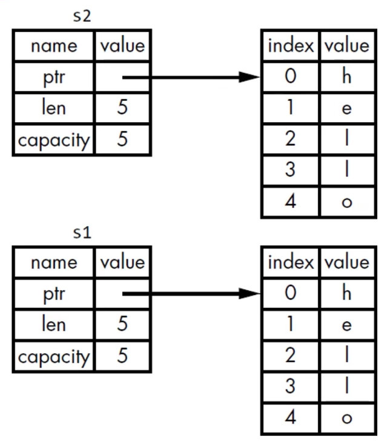

# Rust book 学习笔记

- **《The Rust Programming Language》或中文版《Rust权威指南》**

## 说明

- **每个知识点对应一个binary crate,即src下的一个文件，用cargo workspace管理**
- **用cargo run --bin 文件夹名称（ 即binary crate name）的方式运行**

## 1、依赖 

- ​	**添加crate 依赖：**
  - **在Cargo.toml文件[dependencies]下可按照如下的格式添加依赖**
  - **rand = "0.7.0"**
  - **上面的格式其实是rand = "^0.7.0"的简写，表示依赖在0.7.0以上，但小于0.8.0的版本，cargo build 第一次运行时会创建Cargo.lock文件，并将依赖版本写入，只有在Cargo.toml更新了0.8.0以上的版本时，Cargo.lock文件才会更新**

## 2、变量和数据类型

### 	4种标量类型

- 整数类型：

  - | Length  | Signed  | Unsigned |
    | ------- | ------- | -------- |
    | 8-bit   | `i8`    | `u8`     |
    | 16-bit  | `i16`   | `u16`    |
    | 32-bit  | `i32`   | `u32`    |
    | 64-bit  | `i64`   | `u64`    |
    | 128-bit | `i128`  | `u128`   |
    | arch    | `isize` | `usize`  |

  - 整数的表达方法，除了Byte外，其他整数类型可以使用类型作后缀：如：98**u32**

  - | Number literals  | Example       |
    | ---------------- | ------------- |
    | Decimal          | `98_222`      |
    | Hex              | `0xff`        |
    | Octal            | `0o77`        |
    | Binary           | `0b1111_0000` |
    | Byte (`u8` only) | `b'A'`        |

- 浮点类型

  - | Length | Signed |
    | ------ | ------ |
    | 32     | `f32`  |
    | 64     | `f64`  |

- 布尔类型

  - true
  - false

- 字符类型

  - char作为类型签名，使用单引号，占**4个字节**大小

### 2种复合类型

- tuple
  - （）
  - 保存多个类型的多个值
  - 长度固定，一旦声明不能更改
  - 支持使用模式匹配进行解构
- 数组
  - []
  - 保存同一类型的多个值
  - 其他同tuple

### 函数

- 函数或者代码块{}的最后一个表达式（不带分号，即；）即为函数或者代码块的返回值，语句（带分号）的返回值为空tuple，即（）
- 也可以使用return返回，返回值必须在函数声明中指明类型
- let 关键字只能在函数内部声明变量

## 3、变量所有权Ownership

### 所有权规则

- 每个值都有一个变量，这个变量是该值的所有者
- 每个值同时只能有一个所有者
- 当所有者超出作用域时，该值被删除（自动调用drop函数）

### 深拷贝和浅拷贝

浅拷贝：只复制stack上的数据引用，不复制heap上的数据本身：

深拷贝：复制stack上的数据引用和heap上的数据：

### rust的所有权转移（move）

复制stack上的引用，将之前的引用销毁（图中s1变灰色），不复制heap上的数据本身：

### rust的copy和drop trait

- 实现了copy trait的数据存在stack上，通过只拷贝存储在栈上的位来复制值
- 如果一个类型或者类型的一部分实现了drop trait ,就不允许再实现copy trait
- 拥有copy trait的类型：
  - 4种标量类型（整数类型、浮点类型、布尔类型、字符类型）
  - tuple ，如果其中所有元素都是实现了copy trait的话

### 所有权和函数

- 函数的调用和返回值也伴随着所有权的转移
- 借用：把变量的引用作为函数的参数的行为
- 使用的变量的引用作为形参使API更具通用型，并不会带来性能上的损失

### 引用的解释和规则

- &：引用的表示符号，允许使用变量的值而不取得变量的所有权
- 引用的本质（s作为s1的引用）：
- 在同一个作用域内，只能满足下列条件中的一个，不能同时满足
  - 一个可变的引用
  - 任意数不可变的引用
- 切片：对变量中部分内容的引用，形式：&[开始索引..结束索引]
- 切片的语法糖：
  - &[..从开始到索引]
  - &[从索引到结束..]
  - &[..] 表示整个数据的切片

## 4、结构体structs

### 5、枚举和模式匹配

### 6、代码组织Package, Crate, Module

- 层级结构：
- 组织规则：
- 
